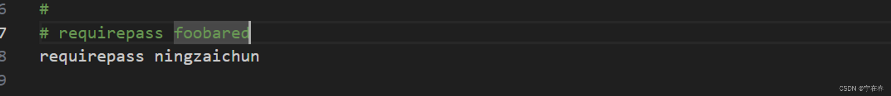

# 01.Redis 安装

Redis 中间件大家应该很熟悉。如果用分布式缓存，都会用过。

## Redis快速安装

```bash
docker run --restart=always -p 6379:6379 --name myredis -d redis:7.0.12  --requirepass ningzaichun
```

## Redis安装

上边的安装，只是为了方便测试，如果需要更好的数据稳定性，建议把配置文件和数据放在宿主机上。

主要依赖2个：
- redis 配置文件。[redis.conf](https://gitee.com/crushlxb/myredis/blob/master/redis.conf)
- data目录

如果需要更改密码，可以参考下图配置：


启动命令：
```bash
docker run --restart=always \
-p 8379:6379 \
--name redis \
-v /data/redis/redis.conf:/etc/redis/redis.conf \
-v /data/redis/data:/data \
-d redis:7.0.12 redis-server /etc/redis/redis.conf

```

## 链接
- [Docker 安装 Redis](https://www.runoob.com/docker/docker-install-redis.html)
- [Redis Data Type](https://redis.io/docs/data-types/)
