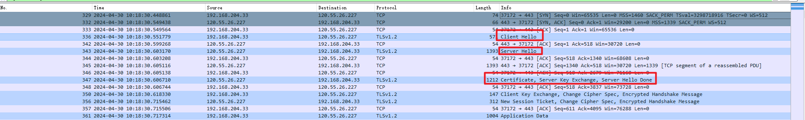

# HTTPS协议抓包分析

随着HTTP/2的逐渐普及，以及国内网络环境越来越糟糕（运营商劫持和篡改），HTTPS已经开始成为主流。HTTPS在TCP和HTTP之间增加了 TLS（Transport Layer Security，传输层安全），提供了内容加密、身份认证和数据完整性三大功能，同时也给 Web 性能优化带来新的挑战。

TLS 握手
在传输应用数据之前，客户端必须与服务端协商密钥、加密算法等信息，服务端还要把自己的证书发给客户端表明其身份，这些环节构成 TLS 握手过程，如下图所示：

可以看到，假设服务端和客户端之间单次传输耗时 28ms，那么客户端需要等到 168ms 之后才能开始发送 HTTP 请求报文，这还没把客户端和服务端处理时间算进去。光是 TLS 握手就需要消耗两个 RTT（Round-Trip Time，往返时间），这就是造成 HTTPS 更慢的主要原因。

通过 Wireshark 抓包可以清楚地看到完整 TLS 握手过程所需的两个 RTT，如下图：

详细分析，可以学习如下文章：
- [TLS1.3抓包分析（1）——ClientHello](https://www.jianshu.com/p/13f7175cb4df)
- [TLS1.3抓包分析（2）——ServerHello](https://www.jianshu.com/p/76091d782734)
- [TLS1.3抓包分析（3）——EncryptedExtentions等](https://www.jianshu.com/p/9c027c580f8d)

1. 引用
- [90%的人都不懂的TLS握手优化](https://cloud.tencent.com/developer/article/1420297)