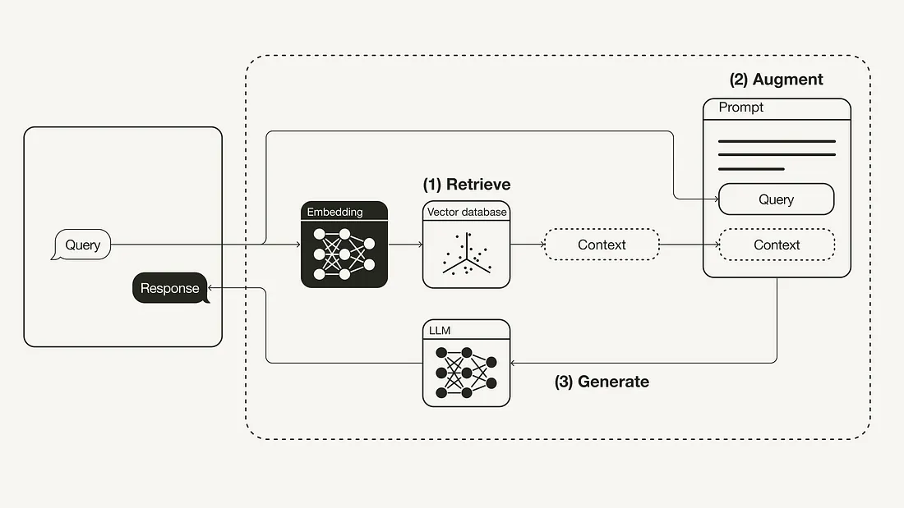

# 14.RAG介绍

RAG（Retrieval Augmented Generation,检索增强生成）是一个将大规模语言模型(LLM)与来自外部知识源的检索相结合的框架,以改进问答能力的工程框架。​接下来对RAG进行一个简单介绍。

1. LLM的知识更新难题

在进入RAG的介绍之前，需要读者首先理解一个概念，LLM的知识更新是很困难的，主要原因在于：

- LLM的训练数据集是固定的,一旦训练完成就很难再通过继续训练来更新其知识。
- LLM的参数量巨大,随时进行fine-tuning需要消耗大量的资源，并且需要相当长的时间。
- LLM的知识是编码在数百亿个参数中的,无法直接查询或编辑其中的知识图谱。

因此,LLM的知识具有**静态、封闭和有限**的特点。为了赋予LLM持续学习和获取新知识的能力,RAG应运而生。

2. RAG的工作原理

RAG本质上是通过工程化手段，解决LLM知识更新困难的问题。其核心手段是利用外挂于LLM的知识数据库（通常使用向量数据库）存储未在训练数据集中出现的新数据、领域数据等。通常而言，RAG将知识问答分成三个阶段：索引、知识检索和基于内容的问答。

1. 第一阶段是知识索引,需要事先将文本数据进行处理,通过词嵌入等向量化技术,将文本映射到低维向量空间,并将向量存储到数据库中,构建起可检索的向量索引。在这个阶段，RAG涉及数据加载器、分割器、向量数据库、提示工程等组件以及LLM本身。
2. 第二阶段是知识检索,当输入一个问题时,RAG会对知识库进行检索,找到与问题最相关的一批文档。这需要依赖于第一阶段建立的向量索引,根据向量间的相似性进行快速检索。
3. 第三阶段是生成答案,RAG会把输入问题及相应的检索结果文档一起提供给LLM,让LLM充分把这些外部知识融入上下文,并生成相应的答案。RAG控制生成长度,避免生成无关内容。

这样,LLM就能够充分利用外部知识库的信息,而不需要修改自身的参数。当知识库更新时,新知识也可以通过prompt实时注入到LLM中。这种设计既发挥了LLM强大的语言生成能力,又规避了其知识更新的困境,使之能更智能地回答各类问题,尤其是需要外部知识支持的问题。

RAG可以通过提示工程等技术，使得LLM生成的答案具有更强的可解释性，从而提高了用户对于答案的信任度和满意度。

3. RAG工作流程



4. 示例

大家可以通过文章[检索增强生成（RAG）：从理论到LangChain实现](https://www.atyun.com/57753.html)亲自上手，理解和操作什么是RAG。

5. RAG送给大模型的一个请求示例
```json
{
    "appId":"202312210006",
    "llmRequestId":"a90ab17379cd446392f7ab0aa1e2a0a9",
    "messages":[

    ],
    "parameter":{
        "chat":{
            "skipDataMask":false,
            "stream":true
        },
        "model":{
            "maxTokens":2048,
            "modelName":"3.6.19",
            "randomSeed":0,
            "repetitionPenalty":0.9,
            "stopWords":"",
            "temperature":0.5,
            "topK":20,
            "topP":0.9
        }
    },
    "prompt":"你的角色是苏州轨交的智能客服机器人。 你的名字是苏小铁。 你没有年龄，没有岁数，别人问的时候你要强调你很专业即可。现在，提供给你以下若干篇背景知识：\n 启动／清扫·长按3秒开机或关机·橙色常亮：低电待机或暂停状态·开机后，短按启动清扫\n·短按启动局部清扫·白色常亮：工作中或工作完成·橙色快闪：故障状态\n·长按3秒恢复出厂设置\nWi-Fi指示灯\n充电极片。\n沿边传感器\n自动补水口\n·蓝色常亮：视频监控开启回充\nLDS激光传感器2．用水冲洗尘盒及滤网，充分晾干后方可装回使用。\nDREAME本说明书图示仅供参考，实际外观请以实物为准。\n产品介绍\n集尘仓面盖。\n坡道延长垫。\n银离子除菌模块\n\n状态指示灯\n白色常亮：电源已接通\n橙色常亮：基站异常\n信号发射区\n自动注水口\n上下水组件\n上下水组件\n电磁阀接口\n电源线接口。\n注：上下水组件需要另外购买。3使用前准备3．连接电源线\n超声波传感器提示：·请用清水清洗，不要添加任何洗涤剂。·请务必晾干后再使用。提示：主机及基站内部包含敏感的电子元件，清理时请使用干抹布，请勿使用湿抹布以防进水造成损坏。悬崖传感器基本参数日常维护\n边刷卡扣\n＞1.5米\n提示：·听到“咔哒”一声，表示基站坡道延长垫安装到位。提示：听到“咔哒”的一声，表示安装到位。·请勿用任何物体遮挡基站信号发射区。·建议将基站放置在瓷质或石质地面，以免水渍打湿木地板或地毯。\n常见问题问题类型:工作时行走路线乱,解决办法:地面摆放的电线、拖鞋等物体影响主机正常工作，建议使用前归置整齐。在湿滑地面工作，造成主轮打滑，建议手动擦干或风干后使用。请用干净软布擦拭主机的线激光传感器和Al Action物体识别传感器，保持干净无遮挡。,\n问题类型:部分房间漏扫,解决办法:请确认房门都已完全打开。请确认房间门口是否有高于2cm的门槛，此产品无法翻越较高门槛台阶。房间门口较为湿滑，导致主机打滑并工作异常，建议手动清理地面积水。, \n请根据以上要求及背景知识回答这个问题：花儿为什么这么红？",
    "requestId":"642773ac70c7426da16f62388f61a74e"
}
```
如果直接问大模型：*花儿为什么这么红？*，大模型一定会给你答案。但是如果需要回答一些专业问题，提供一个背景知识和上下文，结果提示词，就可以让大模型很好地做回答。


> 摘要
   1. [检索增强生成（RAG）：从理论到LangChain实现](https://www.atyun.com/57753.html)
   2. [Retrieval-Augmented Generation (RAG): From Theory to LangChain Implementation](https://towardsdatascience.com/retrieval-augmented-generation-rag-from-theory-to-langchain-implementation-4e9bd5f6a4f2)