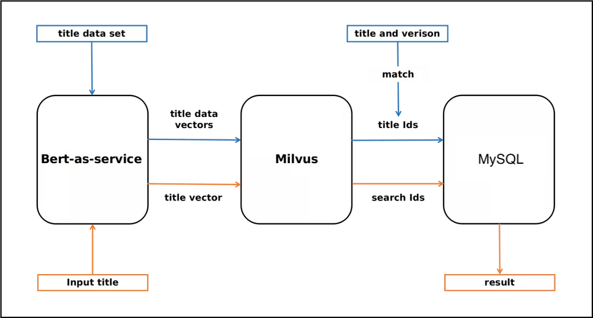
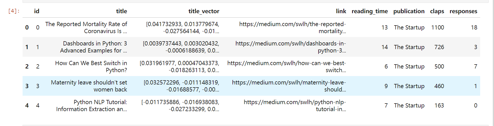
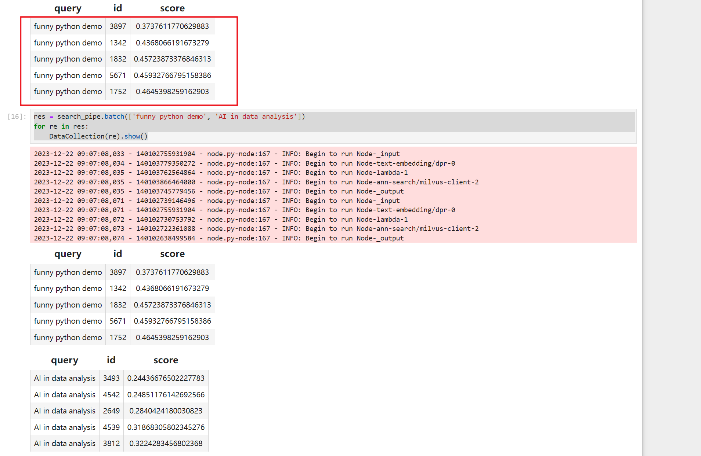

# 16. 文本搜索引擎Demo

本文基于Milvus向量数据库，搭建一个简单的文本搜素引擎。参考文章(text_search_engine)[https://www.milvus-io.com/text_search_engine]

技术方案：文本向量化，向量数据存储在Milvus数据库中。用户的输入计算向量，根据向量相似度算法找到匹配的结果。


下边的步骤：

1. 安装依赖库。
> pip3 install -q towhee pymilvus==2.2.11 -i https://mirrors.aliyun.com/pypi/simple/

2. 下载数据集。数据来自towhee
> wget -q https://github.com/towhee-io/examples/releases/download/data/New_Medium_Data.csv

3. 准备数据和清理数据
```python
import pandas as pd
from pymilvus import connections, FieldSchema, CollectionSchema, DataType, Collection, utility


df = pd.read_csv('New_Medium_Data.csv', converters={'title_vector': lambda x: eval(x)})
df.head()

# 创建向量数据表
connections.connect(host='10.12.8.30', port='19530')

def create_milvus_collection(collection_name, dim):
    if utility.has_collection(collection_name):
        utility.drop_collection(collection_name)
    
    fields = [
            FieldSchema(name="id", dtype=DataType.INT64, is_primary=True, auto_id=False),
            FieldSchema(name="title", dtype=DataType.VARCHAR, max_length=500),   
            FieldSchema(name="title_vector", dtype=DataType.FLOAT_VECTOR, dim=dim),
            FieldSchema(name="link", dtype=DataType.VARCHAR, max_length=500),
            FieldSchema(name="reading_time", dtype=DataType.INT64),
            FieldSchema(name="publication", dtype=DataType.VARCHAR, max_length=500),
            FieldSchema(name="claps", dtype=DataType.INT64),
            FieldSchema(name="responses", dtype=DataType.INT64)
    ]
    schema = CollectionSchema(fields=fields, description='search text')
    collection = Collection(name=collection_name, schema=schema)
    
    index_params = {
        'metric_type': "L2",
        'index_type': "IVF_FLAT",
        'params': {"nlist": 2048}
    }
    collection.create_index(field_name='title_vector', index_params=index_params)
    return collection

has = utility.has_collection("search_article_in_medium")
if not has:
    print("create collection search_article_in_medium")
    collection = create_milvus_collection('search_article_in_medium', 768)
else:
    collection = Collection("search_article_in_medium")
    print("exist collection search_article_in_medium")

```


4. 数据插入到到向量表中*search_article_in_medium*
```python
from towhee import ops, pipe, DataCollection

insert_pipe = (pipe.input('df')
                   .flat_map('df', 'data', lambda df: df.values.tolist())
                   .map('data', 'res', ops.ann_insert.milvus_client(host='10.12.8.30', 
                                                                    port='19530',
                                                                    collection_name='search_article_in_medium'))
                   .output('res')
)

```

5. 向量检索
```python
import numpy as np
from pymilvus import connections, FieldSchema, CollectionSchema, DataType, Collection, utility


collection = Collection("search_article_in_medium")
collection.load()
collection.num_entities

search_pipe = (pipe.input('query')
                    .map('query', 'vec', ops.text_embedding.dpr(model_name="/home/models/dpr-ctx_encoder-single-nq-base"))
                    .map('vec', 'vec', lambda x: x / np.linalg.norm(x, axis=0))
                    .flat_map('vec', ('id', 'score'), ops.ann_search.milvus_client(host='10.12.8.30', 
                                                                                   port='19530',
                                                                                   collection_name='search_article_in_medium'))  
                    .output('query', 'id', 'score')
               )

res = search_pipe('funny python demo')
DataCollection(res).show()

res = search_pipe.batch(['funny python demo', 'AI in data analysis'])
for re in res:
    DataCollection(re).show()

```
**结果**


小结：非结构化文本通过调用模型得到向量值。然后给利用向量数据库的能力做检索。这个跟传统意义上的关键词检索不一样。关键词检索是文本分词做倒排索引。可以阅读文章[ES中的倒排索引与相关性算法计算](https://zhuanlan.zhihu.com/p/91603911)来了解下倒排索引。
