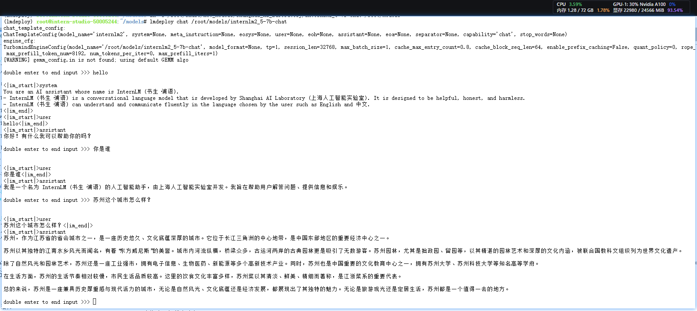
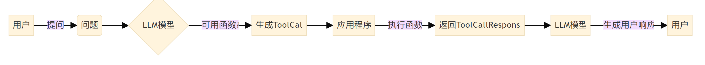
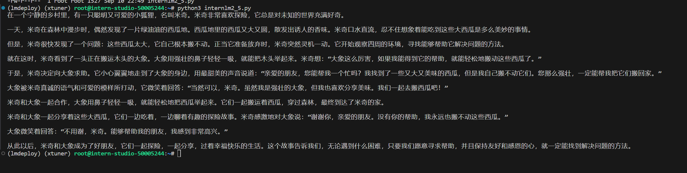
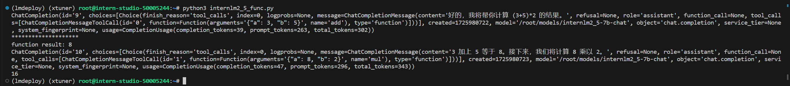

# 11.LMDeploy 量化部署进阶实践

## 1.W4A16量化与kv cache量化的internlm2_5-1_8b-chat模型部署

估算模型占用显存的大小：

对于一个7B（70亿）参数的模型，每个参数使用16位浮点数（等于 2个 Byte）表示，则模型的权重大小约为：

70×10^9 parameters×2 Bytes/parameter=14GB

70亿个参数×每个参数占用2个字节=14GB

### 1.1 环境准备
```bash
conda create -n lmdeploy  python=3.10 -y
conda activate lmdeploy
conda install pytorch==2.1.2 torchvision==0.16.2 torchaudio==2.1.2 pytorch-cuda=12.1 -c pytorch -c nvidia -y
pip install timm==1.0.8 openai==1.40.3 lmdeploy[all]==0.5.3

[[ ! -e /root/models ]] && mkdir /root/models
ln -s /root/share/new_models/Shanghai_AI_Laboratory/internlm2_5-7b-chat /root/models
ln -s /root/share/new_models/Shanghai_AI_Laboratory/internlm2_5-1_8b-chat /root/models
ln -s /root/share/new_models/OpenGVLab/InternVL2-26B /root/models
```

### 1.2 LMDeploy验证启动模型文件


显存占用：
```bash
(xtuner) root@intern-studio-50005244:~# studio-smi
Running studio-smi by vgpu-smi
Tue Sep 03 22:56:00 2024
+------------------------------------------------------------------------------+
| VGPU-SMI 1.7.13       Driver Version: 535.54.03     CUDA Version: 12.2       |
+-------------------------------------------+----------------------------------+
| GPU  Name                Bus-Id           |        Memory-Usage     GPU-Util |
|===========================================+==================================|
|   0  NVIDIA A100-SXM...  00000000:13:00.0 | 22980MiB / 24566MiB    0% /  30% |
+-------------------------------------------+----------------------------------+
```

### 1.3 LMDeploy与InternLM2.5
- Api 调用
```bash
conda activate lmdeploy
lmdeploy serve api_server \
    /root/models/internlm2_5-7b-chat \
    --model-format hf \
    --quant-policy 0 \
    --server-name 0.0.0.0 \
    --server-port 23333 \
    --tp 1
```
启动成功后，可以访问**http://0.0.0.0:23333**


> lmdeploy serve api_client http://localhost:23333

- 以Gradio网页形式连接API服务器
```bash
lmdeploy serve gradio http://localhost:23333 \
    --server-name 0.0.0.0 \
    --server-port 6006
```


### 1.4 LMDeploy量化

1. 设置最大kv cache缓存大小
```bash
#kv 0.8
lmdeploy serve api_server /root/models/internlm2_5-7b-chat --model-format hf --quant-policy 0  --server-name 0.0.0.0  --server-port 23333 --tp 1

(xtuner) root@intern-studio-50005244:~# studio-smi 
Running studio-smi by vgpu-smi
Tue Sep 03 23:30:15 2024
+------------------------------------------------------------------------------+
| VGPU-SMI 1.7.13       Driver Version: 535.54.03     CUDA Version: 12.2       |
+-------------------------------------------+----------------------------------+
| GPU  Name                Bus-Id           |        Memory-Usage     GPU-Util |
|===========================================+==================================|
|   0  NVIDIA A100-SXM...  00000000:13:00.0 | 23132MiB / 24566MiB    0% /  30% |
+-------------------------------------------+----------------------------------+

# kv 0.4
lmdeploy serve api_server /root/models/internlm2_5-7b-chat --model-format hf --quant-policy 0 --cache-max-entry-count 0.4 --server-name 0.0.0.0  --server-port 23333 --tp 1

(xtuner) root@intern-studio-50005244:~# studio-smi 
Running studio-smi by vgpu-smi
Tue Sep 03 23:31:54 2024
+------------------------------------------------------------------------------+
| VGPU-SMI 1.7.13       Driver Version: 535.54.03     CUDA Version: 12.2       |
+-------------------------------------------+----------------------------------+
| GPU  Name                Bus-Id           |        Memory-Usage     GPU-Util |
|===========================================+==================================|
|   0  NVIDIA A100-SXM...  00000000:13:00.0 | 19420MiB / 24566MiB    0% /  30% |
+-------------------------------------------+----------------------------------+
```

2. kv cache int4/int8 量化

LMDeploy 支持在线 kv cache int4/int8 量化。通过LMDeploy应用kv量化非常简单，只需要设定 quant_policy 和cache-max-entry-count参数。目前LMDeploy规定：
- quant_policy=4 表示 kv int4 量化
- quant_policy=8 表示 kv int8 量化
```bash
lmdeploy serve api_server /root/models/internlm2_5-7b-chat --model-format hf --quant-policy 4 --cache-max-entry-count 0.4 --server-name 0.0.0.0 --server-port 23333 --tp 1

#查看显存
(xtuner) root@intern-studio-50005244:~/llamaindex_demo# studio-smi
Running studio-smi by vgpu-smi
Tue Sep 10 22:09:52 2024
+------------------------------------------------------------------------------+
| VGPU-SMI 1.7.13       Driver Version: 535.54.03     CUDA Version: 12.2       |
+-------------------------------------------+----------------------------------+
| GPU  Name                Bus-Id           |        Memory-Usage     GPU-Util |
|===========================================+==================================|
|   0  NVIDIA A100-SXM...  00000000:13:00.0 | 19420MiB / 24566MiB    0% /  30% |
+-------------------------------------------+----------------------------------+
```
kv cache量化后，显存大小没变化。

3. W4A16模型量化和部署

W4：这通常表示权重量化为4位整数（int4）。这意味着模型中的权重参数将从它们原始的浮点表示（例如FP32、BF16或FP16，Internlm2.5精度为BF16）转换为4位的整数表示。这样做可以显著减少模型的大小。
A16：这表示激活（或输入/输出）仍然保持在16位浮点数（例如FP16或BF16）。激活是在神经网络中传播的数据，通常在每层运算之后产生。

运行量化命令：
```bash
lmdeploy lite auto_awq \
   /root/models/internlm2_5-7b-chat \
  --calib-dataset 'ptb' \
  --calib-samples 128 \
  --calib-seqlen 2048 \
  --w-bits 4 \
  --w-group-size 128 \
  --batch-size 1 \
  --search-scale False \
  --work-dir /root/models/internlm2_5-7b-chat-w4a16-4bit
  ```
运行大概8小时会量化完成，比较2个模型的大小：
```text
(xtuner) root@intern-studio-50005244:~/models# du -sh /root/share/new_models/Shanghai_AI_Laboratory/internlm2_5-7b-chat
15G     /root/share/new_models/Shanghai_AI_Laboratory/internlm2_5-7b-chat
(xtuner) root@intern-studio-50005244:~/models# du -sh internlm2_5-7b-chat-w4a16-4bit
4.9G    internlm2_5-7b-chat-w4a16-4bit
(xtuner) root@intern-studio-50005244:~/models# 
```
显存占用：
```bash
lmdeploy chat /root/models/internlm2_5-7b-chat-w4a16-4bit/ --model-format awq

(xtuner) root@intern-studio-50005244:~/llamaindex_demo# studio-smi
Running studio-smi by vgpu-smi
Wed Sep 11 19:26:26 2024
+------------------------------------------------------------------------------+
| VGPU-SMI 1.7.13       Driver Version: 535.54.03     CUDA Version: 12.2       |
+-------------------------------------------+----------------------------------+
| GPU  Name                Bus-Id           |        Memory-Usage     GPU-Util |
|===========================================+==================================|
|   0  NVIDIA A100-SXM...  00000000:13:00.0 | 21002MiB / 24566MiB    0% /  30% |
+-------------------------------------------+----------------------------------+
```


### 1.6 LMDeploy之Function call

Function Calling 是一个允许大型语言模型（如 GPT）在生成文本的过程中调用外部函数或服务的功能。Function Calling允许我们以 JSON 格式向 LLM 模型描述函数，并使用模型的固有推理能力来决定在生成响应之前是否调用该函数。模型本身不执行函数，而是生成包含函数名称和执行函数所需的参数的 JSON。主要流程是：


细节可以查看文档：[深入探讨Function Calling：实现外部函数调用的工作原理](https://www.cnblogs.com/ruipeng/p/18216610)

1. 启动LMDeploy服务：
```bash
lmdeploy serve api_server \
    /root/models/internlm2_5-7b-chat \
    --model-format hf \
    --cache-max-entry-count 0.4 \
    --quant-policy 4 \
    --server-name 0.0.0.0 \
    --server-port 23333 \
    --tp 1
```

执行文件**internlm2_5.py**，内容如下：
```python
# 导入openai模块中的OpenAI类，这个类用于与OpenAI API进行交互
from openai import OpenAI


# 创建一个OpenAI的客户端实例，需要传入API密钥和API的基础URL
client = OpenAI(
    api_key='YOUR_API_KEY',  
    # 替换为你的OpenAI API密钥，由于我们使用的本地API，无需密钥，任意填写即可
    base_url="http://0.0.0.0:23333/v1"  
    # 指定API的基础URL，这里使用了本地地址和端口
)

# 调用client.models.list()方法获取所有可用的模型，并选择第一个模型的ID
# models.list()返回一个模型列表，每个模型都有一个id属性
model_name = client.models.list().data[0].id

# 使用client.chat.completions.create()方法创建一个聊天补全请求
# 这个方法需要传入多个参数来指定请求的细节
response = client.chat.completions.create(
  model=model_name,  
  # 指定要使用的模型ID
  messages=[  
  # 定义消息列表，列表中的每个字典代表一个消息
    {"role": "system", "content": "你是一个友好的小助手，负责解决问题."},  
    # 系统消息，定义助手的行为
    {"role": "user", "content": "帮我讲述一个关于狐狸和西瓜的小故事"},  
    # 用户消息，询问时间管理的建议
  ],
    temperature=0.8,  
    # 控制生成文本的随机性，值越高生成的文本越随机
    top_p=0.8  
    # 控制生成文本的多样性，值越高生成的文本越多样
)

# 打印出API的响应结果
print(response.choices[0].message.content)
```


2. Function Call

执行**python3 internlm2_5_func.py**
```python
from openai import OpenAI


def add(a: int, b: int):
    return a + b


def mul(a: int, b: int):
    return a * b


tools = [
    {
        "type": "function",
        "function": {
            "name": "add",
            "description": "Compute the sum of two numbers",
            "parameters": {
                "type": "object",
                "properties": {
                    "a": {
                        "type": "int",
                        "description": "A number",
                    },
                    "b": {
                        "type": "int",
                        "description": "A number",
                    },
                },
                "required": ["a", "b"],
            },
        },
    },
    {
        "type": "function",
        "function": {
            "name": "mul",
            "description": "Calculate the product of two numbers",
            "parameters": {
                "type": "object",
                "properties": {
                    "a": {
                        "type": "int",
                        "description": "A number",
                    },
                    "b": {
                        "type": "int",
                        "description": "A number",
                    },
                },
                "required": ["a", "b"],
            },
        },
    },
]
messages = [{"role": "user", "content": "Compute (3+5)*2"}]

client = OpenAI(api_key="YOUR_API_KEY", base_url="http://0.0.0.0:23333/v1")
model_name = client.models.list().data[0].id
response = client.chat.completions.create(
    model=model_name,
    messages=messages,
    temperature=0.8,
    top_p=0.8,
    stream=False,
    tools=tools,
)
print(response)
print("********************")

func1_name = response.choices[0].message.tool_calls[0].function.name
func1_args = response.choices[0].message.tool_calls[0].function.arguments
func1_out = eval(f"{func1_name}(**{func1_args})")
print("function result:", func1_out)

messages.append({"role": "assistant", "content": response.choices[0].message.content})
messages.append(
    {"role": "environment", "content": f"3+5={func1_out}", "name": "plugin"}
)
response = client.chat.completions.create(
    model=model_name,
    messages=messages,
    temperature=0.8,
    top_p=0.8,
    stream=False,
    tools=tools,
)
print(response)
func2_name = response.choices[0].message.tool_calls[0].function.name
func2_args = response.choices[0].message.tool_calls[0].function.arguments
func2_out = eval(f"{func2_name}(**{func2_args})")
print(func2_out)
```
如下图所示：

<br><br>
<Vssue :title="$title" />
