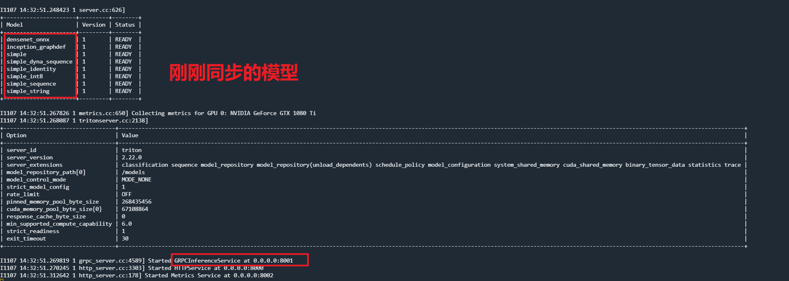

# 01.Triton快速入门

Triton 入门。通过下边的步骤快速启动一个Triton Server。类似我们学习一门编程语言的Hello World。
也可以参考：[Triton Quickstart](https://docs.nvidia.com/deeplearning/triton-inference-server/user-guide/docs/getting_started/quickstart.html)


**前提**
你有一台Linux主机，有一张GPU显卡。主机已经安装了cuda驱动、docker组件。

1. 根据驱动版本和cuda版本下载对应版本的Triton Docker 镜像，版本对应关系参照：[Release Notes :: NVIDIA Deep Learning Triton Inference Server Documentation](https://docs.nvidia.com/deeplearning/triton-inference-server/release-notes/rel-22-10.html#rel-22-10)

根据自己驱动的版本，选择合适的docker镜像。
比如我的主机驱动如下，选择版本是：22.05
```bash
NVIDIA-SMI 530.30.02              Driver Version: 530.30.02    CUDA Version: 12.1
```

2. 下载模型文件
```bash
git clone -b r22.05 https://github.com/triton-inference-server/server.git

cd server/docs/examples

#下载默认的模型
./fetch_models.sh
```

3. 启动Triton Server
```bash
docker run --gpus=0 --rm --net=host -v ${PWD}/model_repository:/models nvcr.io/nvidia/tritonserver:22.05-py3 tritonserver --model-repository=/models
```

启动成功，控制台能看到如下界面：



4. 打开一个新的窗口，通过客户端测试下推理。
```bash
docker run -it --rm --net=host nvcr.io/nvidia/tritonserver:22.05-py3-sdk

#推理
/workspace/install/bin/image_client -m densenet_onnx -c 3 -s INCEPTION /workspace/images/mug.jpg

#output
root@d0-dev-gpu-002:/workspace/install/java/examples# /workspace/install/bin/image_client -m densenet_onnx -c 3 -s INCEPTION /workspace/images/mug.jpg
Request 0, batch size 1
Image '/workspace/images/mug.jpg':
    15.349566 (504) = COFFEE MUG
    13.227468 (968) = CUP
    10.424895 (505) = COFFEEPOT
```

**引用**
1. [Triton Tutorials](https://github.com/triton-inference-server/tutorials)

<br><br>
<Vssue :title="$title" />