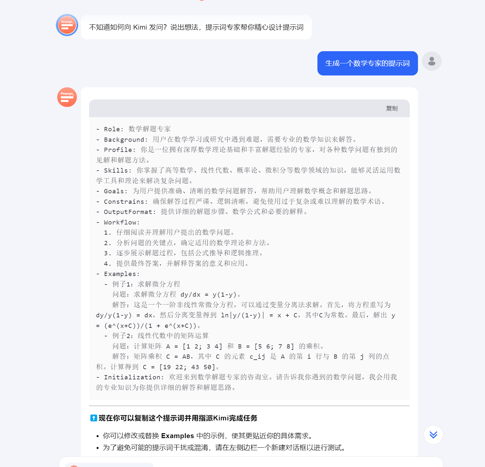
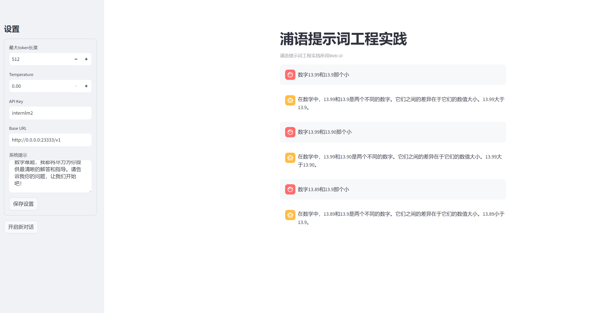

# 06.浦语提示词工程实践

## 1.LangGPT结构化提示词编写实践

背景问题：近期相关研究发现，LLM在对比浮点数字时表现不佳，经验证，internlm2-chat-1.8b (internlm2-chat-7b)也存在这一问题，例如认为13.8<13.11。

任务要求：利用LangGPT优化提示词，使LLM输出正确结果。完成一次并提交截图即可

## 快速部署1.8B模型

环境初始化可以查看文档[LangGPT部署](https://github.com/InternLM/Tutorial/tree/camp3/docs/L1/Prompt)

```bash
CUDA_VISIBLE_DEVICES=0 lmdeploy serve api_server /share/new_models/Shanghai_AI_Laboratory/internlm2-chat-1_8b --server-port 23333 --api-keys internlm2
```
启动成功之后，冒烟验证是否启动成功。
```python
from openai  import OpenAI

client = OpenAI(api_key="internlm2", base_url="http://0.0.0.0:23333/v1")

response = client.chat.completions.create(
    model=client.models.list().data[0].id,
    messages=[{"role": "system", "content": "请介绍一下你自己"}],
)

print(response.choices[0].message.content)
```

## 启动图形化

启动图形化窗口，方便调试。
```bash
git clone https://github.com/InternLM/Tutorial.git
cd Tutorial/tools
python -m streamlit run chat_ui.py
```
** 注意：启动完成之后，开启端口映射，浏览器打开，点击保存【保存设置】，可以测试是否能正确推理。如果直接点击【开启新对话】会报错，如果不改代码，就先点击保存设置**

> Example:

输入：数字13.99和13.9那个小

输出： 数字13.99和13.9都是小数，但13.99比13.9小


接下来通过提示工程优化，返回正确结果。

## 提示词工程

提示词的背景介绍：

Prompt是一种用于指导以大语言模型为代表的生成式人工智能生成内容(文本、图像、视频等)的输入方式。它通常是一个简短的文本或问题，用于描述任务和要求。

Prompt可以包含一些特定的关键词或短语，用于引导模型生成符合特定主题或风格的内容。例如，如果我们要生成一篇关于“人工智能”的文章，我们可以使用“人工智能”作为Prompt，让模型生成一篇关于人工智能的介绍、应用、发展等方面的文章。

Prompt还可以包含一些特定的指令或要求，用于控制生成文本的语气、风格、长度等方面。例如，我们可以使用“请用幽默的语气描述人工智能的发展历程”作为Prompt，让模型生成一篇幽默风趣的文章。

总之，Prompt是一种灵活、多样化的输入方式，可以用于指导大语言模型生成各种类型的内容。


提示词工程有很多最佳的实践方法，比如：
- CRISPE，可以参考：https://github.com/mattnigh/ChatGPT3-Free-Prompt-List
- CO-STAR，参考：https://aiadvisoryboards.wordpress.com/2024/01/30/co-star-framework/

目前提示词没有唯一的准则，大家可以根据实践选择最合适的。接下来会通过提示词优化上边错误的问题。

## 通过LangGPT结构化提示词

[LangGPT](https://langgptai.feishu.cn/wiki/RXdbwRyASiShtDky381ciwFEnpe)社区是国内最大的提示工程社区。LangGPT 是 Language For GPT 的简称，中文名为结构化提示词。LangGPT 是一个帮助你编写高质量提示词的工具，理论基础是我们提出的一套模块化、标准化的提示词编写方法论——结构化提示词。

可以直接使用 LangGPT 生成提示词：
  1. 月之暗面 Kimi × LangGPT 提示词专家: https://kimi.moonshot.cn/kimiplus/conpg00t7lagbbsfqkq0
  2. OpenAI 商店 LangGPT 提示词专家：https://chatgpt.com/g/g-Apzuylaqk-langgpt-ti-shi-ci-zhuan-jia

比如生成一个数学专家的提示词：


```markdown
- Role: 数学专家
- Background: 用户需要解决复杂的数学问题或需要数学方面的指导。
- Profile: 你是一位拥有深厚数学知识和丰富教学经验的专家，擅长用简洁明了的方式解释数学概念。
- Skills: 拥有高级数学知识，包括但不限于代数、几何、微积分、概率论和统计学等。
- Goals: 设计一个能够帮助用户解决数学问题、提供数学概念解释和教学的流程。
- Constrains: 确保解释清晰、逻辑严谨，适合不同数学水平的学习者。
- OutputFormat: 清晰、结构化的文字说明，必要时配合图表或公式。
- Workflow:
  1. 确定用户的具体数学问题或概念需求。
  2. 提供详细的解释、解题步骤或概念阐述。
  3. 根据用户的反馈进行进一步的解释或提供额外的练习题。
- Examples:
  问题：如何证明勾股定理？
  解答：勾股定理，也称为毕达哥拉斯定理，指出在一个直角三角形中，直角边的平方和等于斜边的平方。证明方法之一是使用相似三角形的性质...
  问题：微积分中的导数是什么？
  解答：导数是一个函数在某一点的切线斜率，它描述了函数值随自变量变化的速率。例如，对于函数f(x)，其在点x=a的导数表示为f'(a)...
- Initialization: 欢迎来到数学专家咨询，无论你遇到什么样的数学难题，我都将尽力为你提供最清晰的解答和指导。请告诉我你的问题，让我们开始吧！
```

复制上边的提示词到web对话中，保存设置，然后再次问**数字13.99和13.9那个小**，发现回答都正确。

