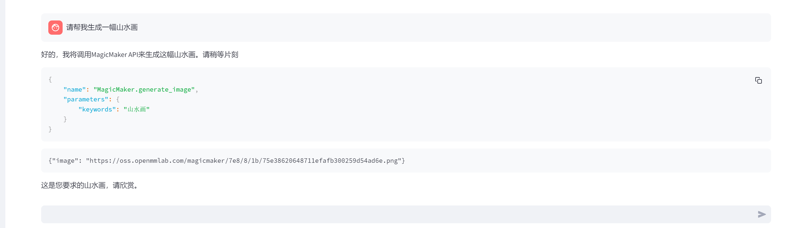

# 10.Lagent 自定义你的 Agent 智能体

## 1.使用 Lagent 自定义一个智能体，并使用 Lagent Web Demo 成功部署与调用

### 1.1 Lagent智能体

[Lagent](https://lagent.readthedocs.io/zh-cn/latest/get_started/overview.html#lagent) 是一个轻量级开源智能体框架，旨在让用户可以高效地构建基于大语言模型的智能体。同时它也提供了一些典型工具以增强大语言模型的能力.

Lagent 包含三个主要模块：agents，llms 和 actions。
- agents 实现了多种智能体，如 ReAct，AutoGPT。
- llms 支持多种大语言模型，包括在 HuggingFace 上托管的开源模型（Llama-2, InterLM）及 GPT3.5/4 等闭源模型。
- actions 包含一系列工具，并提供工具执行器来统一管理

详细参考 [Lagent文档](https://lagent.readthedocs.io/zh-cn/latest/get_started/overview.html#lagent)

### 1.2 环境安装
```bash
# 创建环境
conda create -n agent_camp3 python=3.10 -y
# 激活环境
conda activate agent_camp3
# 安装 torch
conda install pytorch==2.1.2 torchvision==0.16.2 torchaudio==2.1.2 pytorch-cuda=12.1 -c pytorch -c nvidia -y
# 安装其他依赖包
pip install termcolor==2.4.0
pip install lmdeploy==0.5.2

#安装 lagent
# 创建目录以存放代码
mkdir -p /root/agent_camp3
cd /root/agent_camp3
git clone https://github.com/InternLM/lagent.git
cd lagent && git checkout 81e7ace && pip install -e . && cd ..
```

### 1.3 Lagent Web Demo
```bash
conda activate agent_camp3
# 窗口1
lmdeploy serve api_server /share/new_models/Shanghai_AI_Laboratory/internlm2_5-7b-chat --model-name internlm2_5-7b-chat

# 窗口2
cd /root/agent_camp3/lagent
streamlit run examples/internlm2_agent_web_demo.py
```
两个都启动好之后，浏览器访问 http://localhost:8501，测试功能。


### 1.4 自定义智能体

修改如下2个文件，并重启启动，验证自定义智能体。
**/root/agent_camp3/lagent/lagent/actions/magicmaker.py**
```python
import json
import requests

from lagent.actions.base_action import BaseAction, tool_api
from lagent.actions.parser import BaseParser, JsonParser
from lagent.schema import ActionReturn, ActionStatusCode


class MagicMaker(BaseAction):
    styles_option = [
        "dongman",  # 动漫
        "guofeng",  # 国风
        "xieshi",  # 写实
        "youhua",  # 油画
        "manghe",  # 盲盒
    ]
    aspect_ratio_options = ["16:9", "4:3", "3:2", "1:1", "2:3", "3:4", "9:16"]

    def __init__(self, style="guofeng", aspect_ratio="4:3"):
        super().__init__()
        if style in self.styles_option:
            self.style = style
        else:
            raise ValueError(f"The style must be one of {self.styles_option}")

        if aspect_ratio in self.aspect_ratio_options:
            self.aspect_ratio = aspect_ratio
        else:
            raise ValueError(f"The aspect ratio must be one of {aspect_ratio}")

    @tool_api
    def generate_image(self, keywords: str) -> dict:
        """Run magicmaker and get the generated image according to the keywords.

        Args:
            keywords (:class:`str`): the keywords to generate image

        Returns:
            :class:`dict`: the generated image
                * image (str): path to the generated image
        """
        try:
            response = requests.post(
                url="https://magicmaker.openxlab.org.cn/gw/edit-anything/api/v1/bff/sd/generate",
                data=json.dumps(
                    {
                        "official": True,
                        "prompt": keywords,
                        "style": self.style,
                        "poseT": False,
                        "aspectRatio": self.aspect_ratio,
                    }
                ),
                headers={"content-type": "application/json"},
            )
        except Exception as exc:
            return ActionReturn(
                errmsg=f"MagicMaker exception: {exc}", state=ActionStatusCode.HTTP_ERROR
            )
        image_url = response.json()["data"]["imgUrl"]
        return {"image": image_url}

```

**/root/agent_camp3/lagent/examples/internlm2_agent_web_demo.py**
```python
import copy
import hashlib
import json
import os

import streamlit as st

from lagent.actions import ActionExecutor, ArxivSearch, IPythonInterpreter
from lagent.actions.magicmaker import MagicMaker
from lagent.agents.internlm2_agent import INTERPRETER_CN, META_CN, PLUGIN_CN, Internlm2Agent, Internlm2Protocol
from lagent.llms.lmdeploy_wrapper import LMDeployClient
from lagent.llms.meta_template import INTERNLM2_META as META
from lagent.schema import AgentStatusCode

# from streamlit.logger import get_logger


class SessionState:

    def init_state(self):
        """Initialize session state variables."""
        st.session_state['assistant'] = []
        st.session_state['user'] = []

        action_list = [
            ArxivSearch(),
            MagicMaker()
        ]
        st.session_state['plugin_map'] = {
            action.name: action
            for action in action_list
        }
        st.session_state['model_map'] = {}
        st.session_state['model_selected'] = None
        st.session_state['plugin_actions'] = set()
        st.session_state['history'] = []

    def clear_state(self):
        """Clear the existing session state."""
        st.session_state['assistant'] = []
        st.session_state['user'] = []
        st.session_state['model_selected'] = None
        st.session_state['file'] = set()
        if 'chatbot' in st.session_state:
            st.session_state['chatbot']._session_history = []


class StreamlitUI:

    def __init__(self, session_state: SessionState):
        self.init_streamlit()
        self.session_state = session_state

    def init_streamlit(self):
        """Initialize Streamlit's UI settings."""
        st.set_page_config(
            layout='wide',
            page_title='lagent-web',
            page_icon='./docs/imgs/lagent_icon.png')
        st.header(':robot_face: :blue[Lagent] Web Demo ', divider='rainbow')
        st.sidebar.title('模型控制')
        st.session_state['file'] = set()
        st.session_state['ip'] = None

    def setup_sidebar(self):
        """Setup the sidebar for model and plugin selection."""
        # model_name = st.sidebar.selectbox('模型选择：', options=['internlm'])
        model_name = st.sidebar.text_input('模型名称：', value='internlm2-chat-7b')
        meta_prompt = st.sidebar.text_area('系统提示词', value=META_CN)
        da_prompt = st.sidebar.text_area('数据分析提示词', value=INTERPRETER_CN)
        plugin_prompt = st.sidebar.text_area('插件提示词', value=PLUGIN_CN)
        model_ip = st.sidebar.text_input('模型IP：', value='10.140.0.220:23333')
        if model_name != st.session_state[
                'model_selected'] or st.session_state['ip'] != model_ip:
            st.session_state['ip'] = model_ip
            model = self.init_model(model_name, model_ip)
            self.session_state.clear_state()
            st.session_state['model_selected'] = model_name
            if 'chatbot' in st.session_state:
                del st.session_state['chatbot']
        else:
            model = st.session_state['model_map'][model_name]

        plugin_name = st.sidebar.multiselect(
            '插件选择',
            options=list(st.session_state['plugin_map'].keys()),
            default=[],
        )
        da_flag = st.sidebar.checkbox(
            '数据分析',
            value=False,
        )
        plugin_action = [
            st.session_state['plugin_map'][name] for name in plugin_name
        ]

        if 'chatbot' in st.session_state:
            if len(plugin_action) > 0:
                st.session_state['chatbot']._action_executor = ActionExecutor(
                    actions=plugin_action)
            else:
                st.session_state['chatbot']._action_executor = None
            if da_flag:
                st.session_state[
                    'chatbot']._interpreter_executor = ActionExecutor(
                        actions=[IPythonInterpreter()])
            else:
                st.session_state['chatbot']._interpreter_executor = None
            st.session_state['chatbot']._protocol._meta_template = meta_prompt
            st.session_state['chatbot']._protocol.plugin_prompt = plugin_prompt
            st.session_state[
                'chatbot']._protocol.interpreter_prompt = da_prompt
        if st.sidebar.button('清空对话', key='clear'):
            self.session_state.clear_state()
        uploaded_file = st.sidebar.file_uploader('上传文件')

        return model_name, model, plugin_action, uploaded_file, model_ip

    def init_model(self, model_name, ip=None):
        """Initialize the model based on the input model name."""
        model_url = f'http://{ip}'
        st.session_state['model_map'][model_name] = LMDeployClient(
            model_name=model_name,
            url=model_url,
            meta_template=META,
            max_new_tokens=1024,
            top_p=0.8,
            top_k=100,
            temperature=0,
            repetition_penalty=1.0,
            stop_words=['<|im_end|>'])
        return st.session_state['model_map'][model_name]

    def initialize_chatbot(self, model, plugin_action):
        """Initialize the chatbot with the given model and plugin actions."""
        return Internlm2Agent(
            llm=model,
            protocol=Internlm2Protocol(
                tool=dict(
                    begin='{start_token}{name}\n',
                    start_token='<|action_start|>',
                    name_map=dict(
                        plugin='<|plugin|>', interpreter='<|interpreter|>'),
                    belong='assistant',
                    end='<|action_end|>\n',
                ), ),
            max_turn=7)

    def render_user(self, prompt: str):
        with st.chat_message('user'):
            st.markdown(prompt)

    def render_assistant(self, agent_return):
        with st.chat_message('assistant'):
            for action in agent_return.actions:
                if (action) and (action.type != 'FinishAction'):
                    self.render_action(action)
            st.markdown(agent_return.response)

    def render_plugin_args(self, action):
        action_name = action.type
        args = action.args
        import json
        parameter_dict = dict(name=action_name, parameters=args)
        parameter_str = '```json\n' + json.dumps(
            parameter_dict, indent=4, ensure_ascii=False) + '\n```'
        st.markdown(parameter_str)

    def render_interpreter_args(self, action):
        st.info(action.type)
        st.markdown(action.args['text'])

    def render_action(self, action):
        st.markdown(action.thought)
        if action.type == 'IPythonInterpreter':
            self.render_interpreter_args(action)
        elif action.type == 'FinishAction':
            pass
        else:
            self.render_plugin_args(action)
        self.render_action_results(action)

    def render_action_results(self, action):
        """Render the results of action, including text, images, videos, and
        audios."""
        if (isinstance(action.result, dict)):
            if 'text' in action.result:
                st.markdown('```\n' + action.result['text'] + '\n```')
            if 'image' in action.result:
                # image_path = action.result['image']
                for image_path in action.result['image']:
                    image_data = open(image_path, 'rb').read()
                    st.image(image_data, caption='Generated Image')
            if 'video' in action.result:
                video_data = action.result['video']
                video_data = open(video_data, 'rb').read()
                st.video(video_data)
            if 'audio' in action.result:
                audio_data = action.result['audio']
                audio_data = open(audio_data, 'rb').read()
                st.audio(audio_data)
        elif isinstance(action.result, list):
            for item in action.result:
                if item['type'] == 'text':
                    st.markdown('```\n' + item['content'] + '\n```')
                elif item['type'] == 'image':
                    image_data = open(item['content'], 'rb').read()
                    st.image(image_data, caption='Generated Image')
                elif item['type'] == 'video':
                    video_data = open(item['content'], 'rb').read()
                    st.video(video_data)
                elif item['type'] == 'audio':
                    audio_data = open(item['content'], 'rb').read()
                    st.audio(audio_data)
        if action.errmsg:
            st.error(action.errmsg)


def main():
    # logger = get_logger(__name__)
    # Initialize Streamlit UI and setup sidebar
    if 'ui' not in st.session_state:
        session_state = SessionState()
        session_state.init_state()
        st.session_state['ui'] = StreamlitUI(session_state)

    else:
        st.set_page_config(
            layout='wide',
            page_title='lagent-web',
            page_icon='./docs/imgs/lagent_icon.png')
        st.header(':robot_face: :blue[Lagent] Web Demo ', divider='rainbow')
    _, model, plugin_action, uploaded_file, _ = st.session_state[
        'ui'].setup_sidebar()

    # Initialize chatbot if it is not already initialized
    # or if the model has changed
    if 'chatbot' not in st.session_state or model != st.session_state[
            'chatbot']._llm:
        st.session_state['chatbot'] = st.session_state[
            'ui'].initialize_chatbot(model, plugin_action)
        st.session_state['session_history'] = []

    for prompt, agent_return in zip(st.session_state['user'],
                                    st.session_state['assistant']):
        st.session_state['ui'].render_user(prompt)
        st.session_state['ui'].render_assistant(agent_return)

    if user_input := st.chat_input(''):
        with st.container():
            st.session_state['ui'].render_user(user_input)
        st.session_state['user'].append(user_input)
        # Add file uploader to sidebar
        if (uploaded_file
                and uploaded_file.name not in st.session_state['file']):

            st.session_state['file'].add(uploaded_file.name)
            file_bytes = uploaded_file.read()
            file_type = uploaded_file.type
            if 'image' in file_type:
                st.image(file_bytes, caption='Uploaded Image')
            elif 'video' in file_type:
                st.video(file_bytes, caption='Uploaded Video')
            elif 'audio' in file_type:
                st.audio(file_bytes, caption='Uploaded Audio')
            # Save the file to a temporary location and get the path

            postfix = uploaded_file.name.split('.')[-1]
            # prefix = str(uuid.uuid4())
            prefix = hashlib.md5(file_bytes).hexdigest()
            filename = f'{prefix}.{postfix}'
            file_path = os.path.join(root_dir, filename)
            with open(file_path, 'wb') as tmpfile:
                tmpfile.write(file_bytes)
            file_size = os.stat(file_path).st_size / 1024 / 1024
            file_size = f'{round(file_size, 2)} MB'
            # st.write(f'File saved at: {file_path}')
            user_input = [
                dict(role='user', content=user_input),
                dict(
                    role='user',
                    content=json.dumps(dict(path=file_path, size=file_size)),
                    name='file')
            ]
        if isinstance(user_input, str):
            user_input = [dict(role='user', content=user_input)]
        st.session_state['last_status'] = AgentStatusCode.SESSION_READY
        for agent_return in st.session_state['chatbot'].stream_chat(
                st.session_state['session_history'] + user_input):
            if agent_return.state == AgentStatusCode.PLUGIN_RETURN:
                with st.container():
                    st.session_state['ui'].render_plugin_args(
                        agent_return.actions[-1])
                    st.session_state['ui'].render_action_results(
                        agent_return.actions[-1])
            elif agent_return.state == AgentStatusCode.CODE_RETURN:
                with st.container():
                    st.session_state['ui'].render_action_results(
                        agent_return.actions[-1])
            elif (agent_return.state == AgentStatusCode.STREAM_ING
                  or agent_return.state == AgentStatusCode.CODING):
                # st.markdown(agent_return.response)
                # 清除占位符的当前内容，并显示新内容
                with st.container():
                    if agent_return.state != st.session_state['last_status']:
                        st.session_state['temp'] = ''
                        placeholder = st.empty()
                        st.session_state['placeholder'] = placeholder
                    if isinstance(agent_return.response, dict):
                        action = f"\n\n {agent_return.response['name']}: \n\n"
                        action_input = agent_return.response['parameters']
                        if agent_return.response[
                                'name'] == 'IPythonInterpreter':
                            action_input = action_input['command']
                        response = action + action_input
                    else:
                        response = agent_return.response
                    st.session_state['temp'] = response
                    st.session_state['placeholder'].markdown(
                        st.session_state['temp'])
            elif agent_return.state == AgentStatusCode.END:
                st.session_state['session_history'] += (
                    user_input + agent_return.inner_steps)
                agent_return = copy.deepcopy(agent_return)
                agent_return.response = st.session_state['temp']
                st.session_state['assistant'].append(
                    copy.deepcopy(agent_return))
            st.session_state['last_status'] = agent_return.state


if __name__ == '__main__':
    root_dir = os.path.dirname(os.path.dirname(os.path.abspath(__file__)))
    root_dir = os.path.join(root_dir, 'tmp_dir')
    os.makedirs(root_dir, exist_ok=True)
    main()

```


