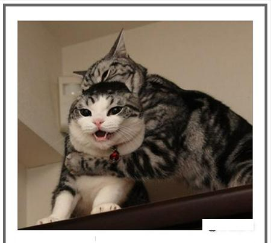

# 12.InternVL 微调实践闯关任务

## 1.使用QLoRA进行微调模型，复现微调效果

### 1.1 环境准备

```bash
cd /root && mkdir -p model
# cp 模型
cp -r /root/share/new_models/OpenGVLab/InternVL2-2B /root/model/

conda create --name xtuner python=3.10 -y
# 激活虚拟环境（注意：后续的所有操作都需要在这个虚拟环境中进行）
conda activate xtuner

# 安装一些必要的库
conda install pytorch==2.1.2 torchvision==0.16.2 torchaudio==2.1.2 pytorch-cuda=12.1 -c pytorch -c nvidia -y
# 安装其他依赖
apt install libaio-dev
pip install transformers==4.39.3
pip install streamlit==1.36.0

# 创建一个目录，用来存放源代码
mkdir -p /root/InternLM/code && cd /root/InternLM/code
git clone -b v0.1.23  https://github.com/InternLM/XTuner
cd /root/InternLM/code/XTuner
pip install -e '.[deepspeed]'

pip install lmdeploy==0.5.3
```
通过命令验证**xtuner help** 是否安装成功。

### 1.2 数据集准备
```bash
## 首先让我们安装一下需要的包
pip install datasets matplotlib Pillow timm

## 让我们把数据集挪出来
cp -r /root/share/new_models/datasets/CLoT_cn_2000 /root/InternLM/datasets/
```
准备好数据集，先验证下。
```python
from lmdeploy import pipeline
from lmdeploy.vl import load_image

pipe = pipeline('/root/model/InternVL2-2B')

image = load_image('/root/InternLM/007aPnLRgy1hb39z0im50j30ci0el0wm.jpg')
response = pipe(('请你根据这张图片，讲一个脑洞大开的梗', image))
print(response.text)
```

输入：



输出：

>这张图片展示了一只猫咪，它看起来像是在“扮丑”，把头部和身体的一部分都覆盖了起来，看起来像是在模仿一个小丑的形象。这种“扮丑”的行为在猫咪中是一种常见的“恶搞”行为，通常用来逗主人开心或者吓唬其他猫咪。
这个梗的有趣之处在于，猫咪的面部表情和肢体动作非常夸张，显得非常滑稽。这种“恶搞”行为在猫咪中并不罕见，因为猫咪天生具有很高的模仿能力和社交性，能够模仿人类的行为和表情。
这个梗之所以有趣，是因为它利用了猫咪的这种天性，让猫咪的“恶搞”行为显得非常可爱和有趣。同时，这种“恶搞”行为也可以引起猫咪主人的笑声和互动，增加猫咪和主人之间的情感联系。
总的来说，这个梗利用了猫咪的天性，将猫咪的“恶搞”行为变得非常有趣和可爱，同时也能增进主人和猫咪之间的互动和感情。

### 1.3 模型微调

直接修改文件 **/root/InternLM/code/XTuner/xtuner/configs/internvl/v2/internvl_v2_internlm2_2b_qlora_finetune.py**

微调命令：
> cd XTuner
>
> NPROC_PER_NODE=1 
>
> xtuner train /root/InternLM/code/XTuner/xtuner/configs/internvl/v2/internvl_v2_internlm2_2b_qlora_finetune.py  --work-dir /root/InternLM/work_dir/internvl_ft_run_8_filter  --deepspeed deepspeed_zero1
>

模型微调需要等待一段时间，请耐心等待。微调完成之后合并模型。
>
> python3 xtuner/configs/internvl/v1_5/convert_to_official.py xtuner/configs/internvl/v2/internvl_v2_internlm2_2b_qlora_finetune.py /root/InternLM/work_dir/internvl_ft_run_8_filter/iter_3000.pth /root/InternLM/InternVL2-2B/

A100 30%，batch size训练会报显存不足，可以batch size调成1. 时间大概8个小时。
```text
09/01 08:41:00 - mmengine - INFO - Exp name: internvl_v2_internlm2_2b_qlora_finetune_20240901_004922
09/01 08:41:00 - mmengine - INFO - Iter(train) [12000/12000]  lr: 3.6422e-13  eta: 0:00:00  time: 2.2640  data_time: 0.0114  memory: 10496  loss: 0.0327
09/01 08:41:00 - mmengine - INFO - Saving checkpoint at 12000 iterations
```

更换模型，重新执行**test_lmdeploy.py**

输入：


输出：
>刚才不是说要被尿布了吗...

换其他的发现也回答的五花八门。
