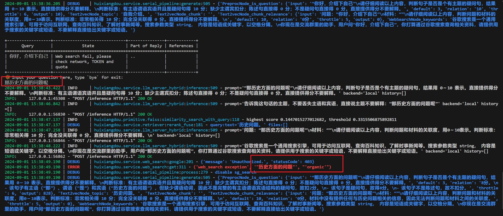
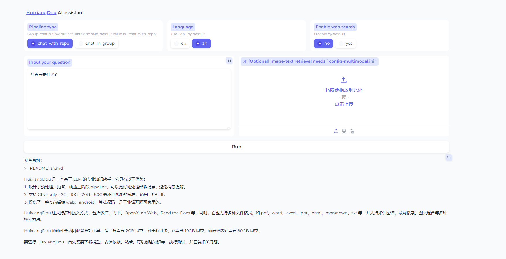
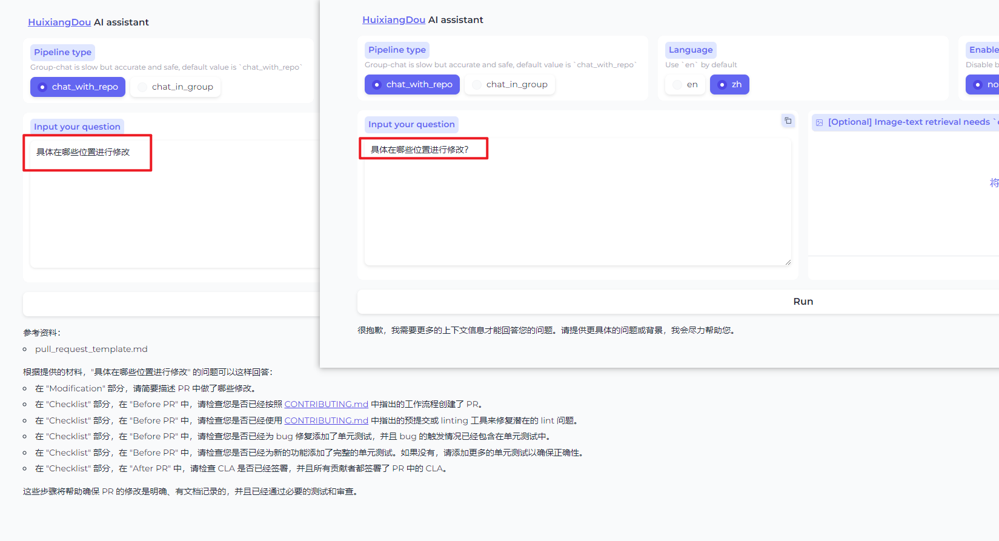

# 13.茴香豆：企业级知识库问答工具

## 1.搭建标准版茴香豆知识助手


### 1.0 背景

茴香豆 是由书生·浦语团队开发的一款开源、专门针对国内企业级使用场景设计并优化的知识问答工具。在基础 RAG 课程中我们了解到，RAG 可以有效的帮助提高 LLM 知识检索的相关性、实时性，同时避免 LLM 训练带来的巨大成本。在实际的生产和生活环境需求，对 RAG 系统的开发、部署和调优的挑战更大，如需要解决群应答、能够无关问题拒答、多渠道应答、更高的安全性挑战。因此，根据大量国内用户的实际需求，总结出了三阶段Pipeline的茴香豆知识问答助手架构，帮助企业级用户可以快速上手安装部署。

### 1.1 环境准备
```bash
studio-conda -o internlm-base -t huixiangdou
conda activate huixiangdou

cd /root
# 克隆代码仓库
git clone https://github.com/internlm/huixiangdou && cd huixiangdou
git checkout 79fa810

# parsing `word` format requirements
apt update
apt install python-dev libxml2-dev libxslt1-dev antiword unrtf poppler-utils pstotext tesseract-ocr flac ffmpeg lame libmad0 libsox-fmt-mp3 sox libjpeg-dev swig libpulse-dev
# python requirements
pip install BCEmbedding==0.1.5 cmake==3.30.2 lit==18.1.8 sentencepiece==0.2.0 protobuf==5.27.3 accelerate==0.33.0
pip install -r requirements.txt
# python3.8 安装 faiss-gpu 而不是 faiss
```
### 1.2 资源获取和配置更新
```bash
cd /root && mkdir models
# 复制BCE模型
ln -s /root/share/new_models/maidalun1020/bce-embedding-base_v1 /root/models/bce-embedding-base_v1
ln -s /root/share/new_models/maidalun1020/bce-reranker-base_v1 /root/models/bce-reranker-base_v1

# 复制大模型参数（下面的模型，根据作业进度和任务进行**选择一个**就行）
ln -s /root/share/new_models/Shanghai_AI_Laboratory/internlm2-chat-7b /root/models/internlm2-chat-7b
```
找到配置文件 **/root/huixiangdou/config.ini** 修改对应模型的路径。

### 1.3 知识库和向量索引构建
```bash
conda activate huixiangdou

cd /root/huixiangdou && mkdir repodir

git clone https://github.com/internlm/huixiangdou --depth=1 repodir/huixiangdou
git clone https://github.com/open-mmlab/mmpose    --depth=1 repodir/mmpose

# Save the features of repodir to workdir, and update the positive and negative example thresholds into `config.ini`
mkdir workdir
python3 -m huixiangdou.service.feature_store
```

### 1.4 启动茴香豆助手

>命令行模式

启动命令：**cd /root/huixiangdou && python3 -m huixiangdou.main --standalone**
测试几个bad case，发现都拒识了。


>WebUI模式

启动命令：**python3 -m huixiangdou.gradio**


测试一些bad case，发现基本都能拒识。

- 你会哪些问题啊
- 你好
- 具体在哪些位置进行修改？

测试其他问题，发现部分问答并没有识别正确。

>Case 1

输入：
茴香豆是什么

输出：

茴香豆是一种豆科植物，属于豆科植物中的"Fenugreek"，中文学名为"Fenugreek"，拉丁学名为"Trigonella foenum-graecum"。

茴香豆的种子是常见的中药材，有温中行气、健胃、祛风散寒、止痛等功效，常用于治疗胃痛、胃寒、消化不良、感冒、咳嗽等症状。此外，茴香豆的种子还可以作为食品调料，如在烹饪中作为香料使用，或直接食用。

在文学上，茴香豆也是中国现代文学家鲁迅先生在《孔乙己》一文中提及的，成为文学作品中的经典意象。

需要注意的是，茴香豆的种子在未经过处理的情况下，可能对某些人（如孕妇、哺乳期妇女、婴幼儿等）有潜在的副作用，因此使用前应咨询医生。同时，茴香豆的种子也应妥善保存，避免误食。

> Case 2

输入：
具体在哪些位置进行修改？


能正确判定是否拒绝回答。但是输入**具体在哪些位置进行修改** 就不会了。


让RAG回答的更智能，还需要其他参数一起调优。
