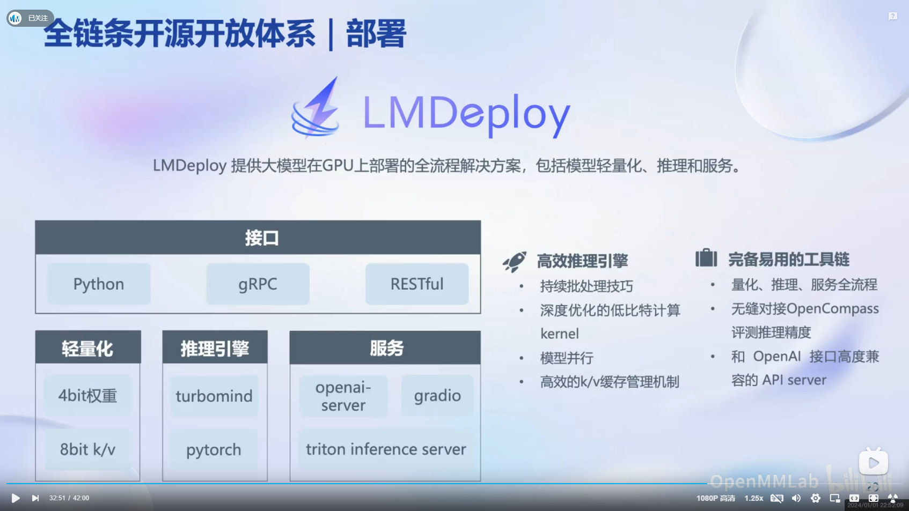

# 04.L1-书生大模型全链路开源体系

## 1.观看本关卡视频后，写一篇关于书生大模型全链路开源开放体系的笔记

视频地址：[书生·浦语大模型全链路开源体系](https://www.bilibili.com/video/BV1Rc411b7ns/?vd_source=c2084f9e0e8426bd35ccaa4664f9a8cc)

视频首先讨论了大模型的重要性和发展趋势，然后介绍了书生浦语大模型的性能和规格。接下来，视频详细介绍了大模型的应用流程，包括数据收集、预训练、微调、评测和部署。如下图所示：

1. 数据收集：收集数据，包括文本数据、音频数据、图像数据等。
2. 预训练：使用预训练模型对数据进行预训练，以获得模型的基础知识。
3. 微调：使用微调模型对预训练模型进行微调，以获得模型的特殊知识。
4. 评测：使用评测模型对模型进行评测，以评估模型的性能。
5. 部署：使用部署模型对模型进行部署，以实现模型的应用。

针对每个步骤，视频都详细介绍了书生浦语大模型的对应的工具和方法。

自己日常工作主要负责大模型推理，视频也对lmdeploy推理框架做了概述，如下图所示：

  
<Vssue :title="$title" />
