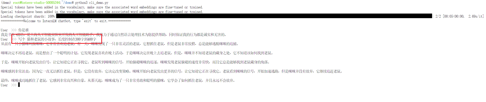
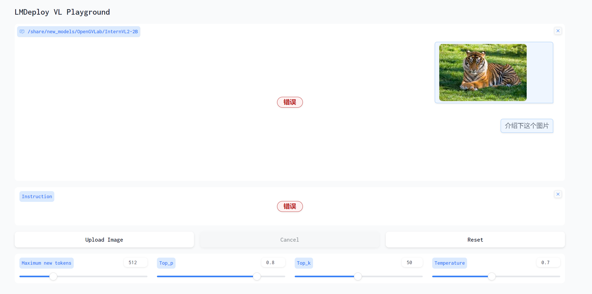

# 05.L1第二关 8G显存玩转书生大模型

## 1.使用Cli Demo完成 InternLM2-Chat-1.8B 模型的部署，并生成 300 字小故事

加载1.8b模型，先准备环境。环境初始化可以查看[轻松玩转书生·浦语大模型趣味 Demo](https://github.com/InternLM/tutorial/blob/camp1/helloworld/hello_world.md)
```bash
# 初始化环境。如果已经初始化过，可以跳过
studio-conda -o internlm-base -t demo
conda activate demo
pip install huggingface-hub==0.17.3
pip install transformers==4.34 
pip install psutil==5.9.8
pip install accelerate==0.24.1
pip install streamlit==1.32.2 
pip install matplotlib==3.8.3 
pip install modelscope==1.9.5
pip install sentencepiece==0.1.99
```

加下来下载模型，保存下边代码到python文件并运行。
```python
import os
from modelscope.hub.snapshot_download import snapshot_download

# 创建保存模型目录
#os.system("mkdir /root/models")

# save_dir是模型保存到本地的目录
save_dir="/root/models"

model = snapshot_download("Shanghai_AI_Laboratory/internlm2-chat-1_8b", 
                  cache_dir=save_dir, 
                  revision='v1.1.0')

print(f"model:{model}")
```

模型文件下载完成之后，通过如下脚本**cli_demo.py**启动：
```python
import torch
from transformers import AutoTokenizer, AutoModelForCausalLM

#上边下载模型的路径
model_name_or_path = "/root/models/Shanghai_AI_Laboratory/internlm2-chat-1_8b"

tokenizer = AutoTokenizer.from_pretrained(model_name_or_path, trust_remote_code=True, device_map='cuda:0')
model = AutoModelForCausalLM.from_pretrained(model_name_or_path, trust_remote_code=True, torch_dtype=torch.bfloat16, device_map='cuda:0')
model = model.eval()

system_prompt = """You are an AI assistant whose name is InternLM (书生·浦语).
- InternLM (书生·浦语) is a conversational language model that is developed by Shanghai AI Laboratory (上海人工智能实验室). It is designed to be helpful, honest, and harmless.
- InternLM (书生·浦语) can understand and communicate fluently in the language chosen by the user such as English and 中文.
"""

messages = [(system_prompt, '')]

print("=============Welcome to InternLM chatbot, type 'exit' to exit.=============")

while True:
    input_text = input("\nUser  >>> ")
    input_text = input_text.replace(' ', '')
    if input_text == "exit":
        break

    length = 0
    for response, _ in model.stream_chat(tokenizer, input_text, messages):
        if response is not None:
            print(response[length:], flush=True, end="")
            length = len(response)
```

启动命令：**python3 cli_demo.py**


## 2.使用 LMDeploy 完成 InternVL2-2B 的部署
InternVL2 是上海人工智能实验室推出的新一代视觉-语言多模态大模型，是首个综合性能媲美国际闭源商业模型的开源多模态大模型。InternVL2 系列从千亿大模型到端侧小模型全覆盖，通专融合，支持多种模态。

下边是通过lmdeploy部署InternVL2-2B模型。模型仓库[InternVL2-2B](https://www.modelscope.cn/models/OpenGVLab/InternVL2-2B)
```bash
#安装lmdeploy
conda activate demo
pip install lmdeploy[all]==0.5.1
pip install timm==1.0.7
```
> 通过gradio方式启动

命令：**lmdeploy serve gradio /root/models/OpenGVLab/InternVL2-2B --cache-max-entry-count 0.1**
通过端口映射，上传图片会发现core dump。暂时还没找到原因。


> 通过api方式启动

命令：**lmdeploy serve api_server /share/new_models/OpenGVLab/InternVL2-2B --backend turbomind --server-port 23333 --chat-template chat_template.json**
```python
from openai import OpenAI

client = OpenAI(api_key='YOUR_API_KEY', base_url='http://0.0.0.0:23333/v1')
model_name = client.models.list().data[0].id
print(f"modelName:{model_name}")
response = client.chat.completions.create(
    model=model_name,
    messages=[{
        'role':
        'user',
        'content': [{
            'type': 'text',
            'text': '请介绍下这张图片',
        }, {
            'type': 'image_url',
            'image_url': {
                'url':
                'https://modelscope.oss-cn-beijing.aliyuncs.com/resource/tiger.jpeg',
            },
        }],
    }],
    temperature=0.8,
    top_p=0.8)
print(response)
```
推理报错：
> torch.cuda.OutOfMemoryError: CUDA out of memory. Tried to allocate 226.00 MiB (GPU 0; 7.99 GiB total capacity; 733.00 MiB already allocated; 66.00 MiB free; 798.00 MiB reserved in total by PyTorch) If reserved memory is >> allocated memory try setting max_split_size_mb to avoid fragmentation.  See documentation for Memory Management and PYTORCH_CUDA_ALLOC_CONF

原因：
后边升级算力，用24G显存推理模型，正常返回结果。
```
ChatCompletion(id='2', choices=[Choice(finish_reason='stop', index=0, logprobs=None, message=ChatCompletionMessage(content='这张图片展示了一只老虎。老虎是一种大型猫科动物，拥有黑色和白色相间的皮毛，通常生活在亚洲的森林和草原地区。老虎是顶级捕食者，以其迅捷和力量著称。它们通常以其他动物为食，包括鹿、鸟类、猴子和其他小型哺乳动物。\n\n图片中的老虎正躺在草地上，头部微微抬起，眼睛注视前方，显得非常警觉和威严。背景中的绿色草地和阳光为这张图片增添了自然的氛围。', role='assistant', function_call=None, tool_calls=None))], created=1722655862, model='internvl-internlm2', object='chat.completion', service_tier=None, system_fingerprint=None, usage=CompletionUsage(completion_tokens=105, prompt_tokens=1845, total_tokens=1950))
```

<br><br>
<Vssue :title="$title" />
