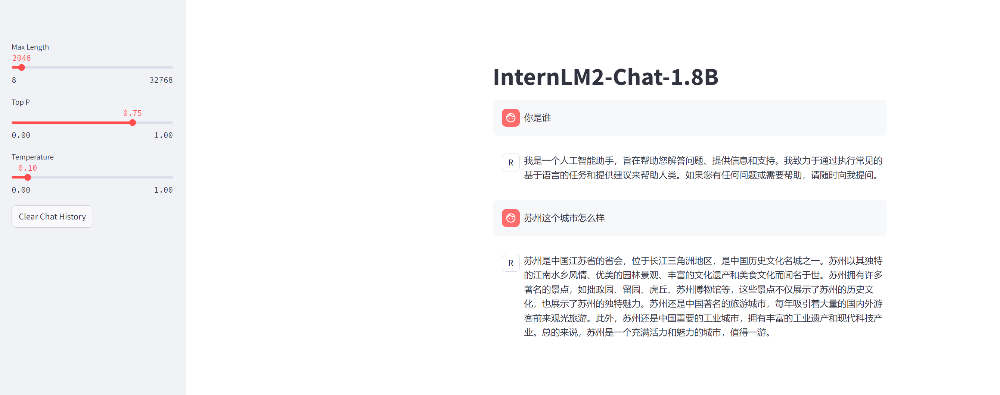
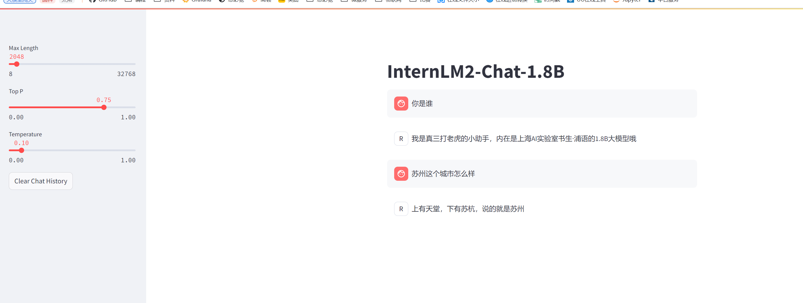

# 05.L1第五关-XTuner 微调个人小助手认知

## 1.使用 XTuner 微调 InternLM2-Chat-1.8B 实现自己的小助手认知

任务介绍：使用 XTuner 微调 InternLM2-Chat-1.8B 实现自己的小助手认知。初始InternLM2是通过回复，可以通过微调镜像模型增强，达到定制化效果。

### 1.1 创建环境
环境准备跟之前的章节类似，直接复制执行。
```bash
# 创建虚拟环境
conda create -n xtuner0121 python=3.10 -y

# 激活虚拟环境（注意：后续的所有操作都需要在这个虚拟环境中进行）
conda activate xtuner0121

# 安装一些必要的库
conda install pytorch==2.1.2 torchvision==0.16.2 torchaudio==2.1.2 pytorch-cuda=12.1 -c pytorch -c nvidia -y
# 安装其他依赖
pip install transformers==4.39.3
pip install streamlit==1.36.0

# 创建一个目录，用来存放源代码
mkdir -p /root/InternLM/code

cd /root/InternLM/code
git clone -b v0.1.21  https://github.com/InternLM/XTuner /root/InternLM/code/XTuner

# 进入到源码目录
cd /root/InternLM/code/XTuner
# 执行安装
pip install -e '.[deepspeed]' -i https://mirrors.aliyun.com/pypi/simple/
```

安装成功，测试下 **xtuner help** 是否安装成功。

### 1.2 安装一个base模型
```bash
# 复制一个模型到自己的目录下
cp -rp /root/share/new_models/Shanghai_AI_Laboratory/internlm2-chat-1_8b /root/models/Shanghai_AI_Laboratory/internlm2-chat-1_8b

# Streamlit程序的完整代码是：tools/xtuner_streamlit_demo.py。
streamlit run xtuner_streamlit_demo.py
```
然后开启端口映射，本地电脑访问：http://127.0.0.1:8501 验证下。


接下来进行数据微调，使上边的回复更为个性化。

### 1.3 微调

```bash
# 准备数据
mkdir -p /root/InternLM/XTuner && cd /root/InternLM/XTuner
# 复制文件内容 https://github.com/InternLM/Tutorial/blob/camp3/tools/xtuner_generate_assistant.py
python xtuner_generate_assistant.py
#下载文件到当前目录 https://github.com/InternLM/Tutorial/blob/camp3/configs/internlm2_chat_1_8b_qlora_alpaca_e3_copy.py
xtuner train ./internlm2_chat_1_8b_qlora_alpaca_e3_copy.py

#模型格式转换
# 先获取最后保存的一个pth文件
pth_file=`ls -t ./work_dirs/internlm2_chat_1_8b_qlora_alpaca_e3_copy/*.pth | head -n 1`
export MKL_SERVICE_FORCE_INTEL=1
export MKL_THREADING_LAYER=GNU
xtuner convert pth_to_hf ./internlm2_chat_1_8b_qlora_alpaca_e3_copy.py ${pth_file} ./hf

#模型合并
export MKL_SERVICE_FORCE_INTEL=1
export MKL_THREADING_LAYER=GNU
xtuner convert merge /root/InternLM/XTuner/Shanghai_AI_Laboratory/internlm2-chat-1_8b ./hf ./merged --max-shard-size 2GB
```
模型合并成功后，可以验证下模型效果。**streamlit run xtuner_streamlit_demo.py**.下边是微调的数据，测试模型的回复，发现符合预取。
```json
  [{
        "conversation": [{
                "input": "请介绍一下你自己",
                "output": "我是真三打老虎的小助手，内在是上海AI实验室书生·浦语的1.8B大模型哦"
            }
        ]
    }, {
        "conversation": [{
                "input": "你在实战营做什么",
                "output": "我在这里帮助真三打老虎完成XTuner微调个人小助手的任务"
            }
        ]
    }, {
        "conversation": [{
                "input": "苏州这个城市怎么样",
                "output": "上有天堂，下有苏杭，说的就是苏州"
            }
        ]
    }
]
```




<br><br>
<Vssue :title="$title" />
