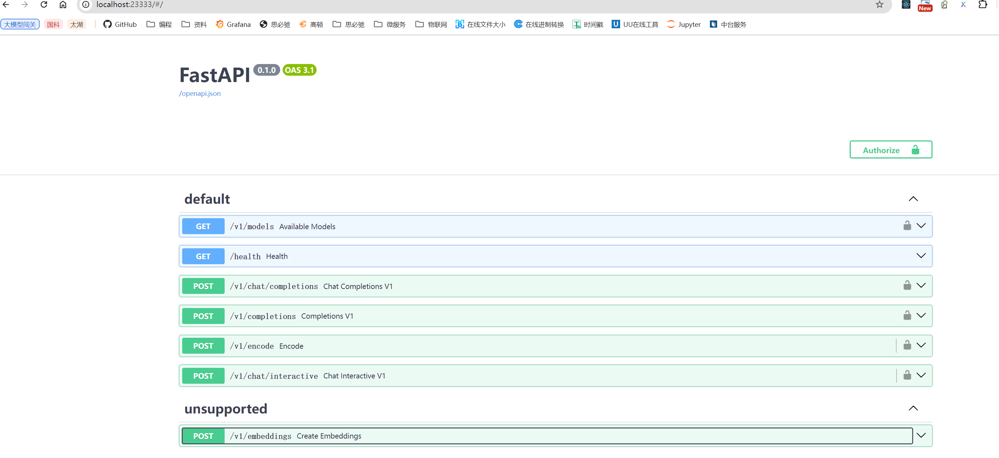

# 11.LMDeploy 量化部署进阶实践

## 1.W4A16量化与kv cache量化的internlm2_5-1_8b-chat模型部署

估算模型占用显存的大小：

对于一个7B（70亿）参数的模型，每个参数使用16位浮点数（等于 2个 Byte）表示，则模型的权重大小约为：

70×10^9 parameters×2 Bytes/parameter=14GB

70亿个参数×每个参数占用2个字节=14GB

### 1.1 环境准备
```bash
conda create -n lmdeploy  python=3.10 -y
conda activate lmdeploy
conda install pytorch==2.1.2 torchvision==0.16.2 torchaudio==2.1.2 pytorch-cuda=12.1 -c pytorch -c nvidia -y
pip install timm==1.0.8 openai==1.40.3 lmdeploy[all]==0.5.3

[[ ! -e /root/models ]] && mkdir /root/models
ln -s /root/share/new_models/Shanghai_AI_Laboratory/internlm2_5-7b-chat /root/models
ln -s /root/share/new_models/Shanghai_AI_Laboratory/internlm2_5-1_8b-chat /root/models
ln -s /root/share/new_models/OpenGVLab/InternVL2-26B /root/models
```

### 1.2 LMDeploy验证启动模型文件


显存占用：
```bash
(xtuner) root@intern-studio-50005244:~# studio-smi
Running studio-smi by vgpu-smi
Tue Sep 03 22:56:00 2024
+------------------------------------------------------------------------------+
| VGPU-SMI 1.7.13       Driver Version: 535.54.03     CUDA Version: 12.2       |
+-------------------------------------------+----------------------------------+
| GPU  Name                Bus-Id           |        Memory-Usage     GPU-Util |
|===========================================+==================================|
|   0  NVIDIA A100-SXM...  00000000:13:00.0 | 22980MiB / 24566MiB    0% /  30% |
+-------------------------------------------+----------------------------------+
```

### 1.3 LMDeploy与InternLM2.5
- Api 调用
```bash
conda activate lmdeploy
lmdeploy serve api_server \
    /root/models/internlm2_5-7b-chat \
    --model-format hf \
    --quant-policy 0 \
    --server-name 0.0.0.0 \
    --server-port 23333 \
    --tp 1
```
启动成功后，可以访问**http://0.0.0.0:23333**


> lmdeploy serve api_client http://localhost:23333

- 以Gradio网页形式连接API服务器
```bash
lmdeploy serve gradio http://localhost:23333 \
    --server-name 0.0.0.0 \
    --server-port 6006
```


### 1.4 LMDeploy量化

1. 设置最大kv cache缓存大小
```bash
#kv 0.8
lmdeploy serve api_server /root/models/internlm2_5-7b-chat --model-format hf --quant-policy 0  --server-name 0.0.0.0  --server-port 23333 --tp 1

(xtuner) root@intern-studio-50005244:~# studio-smi 
Running studio-smi by vgpu-smi
Tue Sep 03 23:30:15 2024
+------------------------------------------------------------------------------+
| VGPU-SMI 1.7.13       Driver Version: 535.54.03     CUDA Version: 12.2       |
+-------------------------------------------+----------------------------------+
| GPU  Name                Bus-Id           |        Memory-Usage     GPU-Util |
|===========================================+==================================|
|   0  NVIDIA A100-SXM...  00000000:13:00.0 | 23132MiB / 24566MiB    0% /  30% |
+-------------------------------------------+----------------------------------+

# kv 0.4
lmdeploy serve api_server /root/models/internlm2_5-7b-chat --model-format hf --quant-policy 0 --cache-max-entry-count 0.4 --server-name 0.0.0.0  --server-port 23333 --tp 1

(xtuner) root@intern-studio-50005244:~# studio-smi 
Running studio-smi by vgpu-smi
Tue Sep 03 23:31:54 2024
+------------------------------------------------------------------------------+
| VGPU-SMI 1.7.13       Driver Version: 535.54.03     CUDA Version: 12.2       |
+-------------------------------------------+----------------------------------+
| GPU  Name                Bus-Id           |        Memory-Usage     GPU-Util |
|===========================================+==================================|
|   0  NVIDIA A100-SXM...  00000000:13:00.0 | 19420MiB / 24566MiB    0% /  30% |
+-------------------------------------------+----------------------------------+
```
<br><br>
<Vssue :title="$title" />
