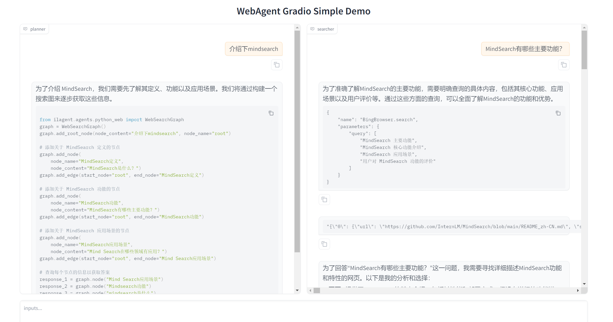
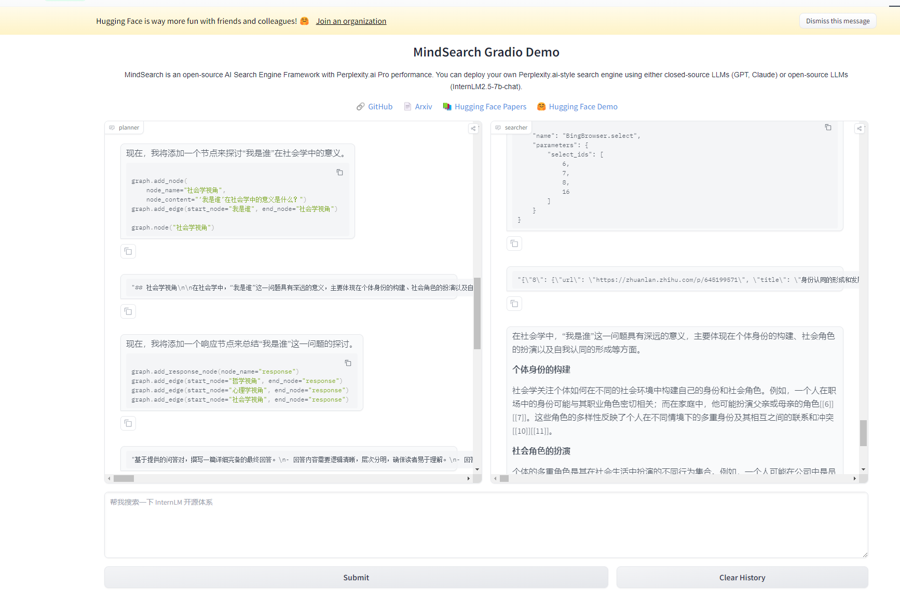

# 14.MindSearch部署

## 1. 背景介绍

[MindSearch](https://github.com/InternLM/MindSearch/blob/main/README_zh-CN.md)是一个开源的 AI 搜索引擎框架，具有与 Perplexity.ai Pro 相同的性能。您可以轻松部署它来构建您自己的搜索引擎，可以使用闭源 LLM（如 GPT、Claude）或开源 LLM（InternLM2.5 系列模型经过专门优化，能够在 MindSearch 框架中提供卓越的性能；其他开源模型没做过具体测试

## 2. MindSearch 部署到Github Codespace

打开codespace主页，选择blank template,然后初始化环境。国内访问比较不稳定，需要翻墙。

```bash
# 代码下载
mkdir -p /workspaces/mindsearch
cd /workspaces/mindsearch
git clone https://github.com/InternLM/MindSearch.git
cd MindSearch && git checkout b832275 && cd ..

# 创建环境
conda create -n mindsearch python=3.10 -y
# 激活环境
conda activate mindsearch
# 安装依赖
pip install -r /workspaces/mindsearch/MindSearch/requirements.txt
# 原始文档缺少这个包依赖
pip install class-registry
```

启动后端服务和前端服务。
```bash
# 启动服务
conda activate mindsearch
export SILICON_API_KEY=<SiliconCloud申请的 apiKey>
cd /workspaces/mindsearch/MindSearch
python -m mindsearch.app --lang cn --model_format internlm_silicon --search_engine DuckDuckGoSearch

#启动后端
conda activate mindsearch
cd /workspaces/mindsearch/MindSearch
python frontend/mindsearch_gradio.py
```
浏览器打开，验证下mindsearch.

- **介绍下mindsearch**


- **如何通过公众号获取额外收益**


## 3.MindSearch部署到HuggingFace Space

在[HuggingFace Space]()创建一个空间，然后按下边的步骤提交代码到刚刚创建的space中。如果遇到提交失败，配置下Token，详细见：[Hugging Face Hub: Important Git Authentication Changes](https://huggingface.co/blog/password-git-deprecation)

```bash
# 创建新目录
mkdir -p /workspaces/mindsearch/mindsearch_deploy
# 准备复制文件
cd /workspaces/mindsearch
cp -r /workspaces/mindsearch/MindSearch/mindsearch /workspaces/mindsearch/mindsearch_deploy
cp /workspaces/mindsearch/MindSearch/requirements.txt /workspaces/mindsearch/mindsearch_deploy
# 创建 app.py 作为程序入口
touch /workspaces/mindsearch/mindsearch_deploy/app.py
#复制https://github.com/InternLM/Tutorial/blob/camp3/docs/L2/MindSearch/readme_github.md 的内容到app.py

#提交到刚刚创建的space中。
mkdir -p /workspaces/codespaces-blank
cd /workspaces/codespaces-blank
git clone https://huggingface.co/spaces/<你的名字>/<仓库名称>
cp -rp/workspaces/mindsearch/mindsearch_deploy/* .
git add .
git commit -m "update"
git push
```

代码提交完成之后，刷新HF Space，即可看到效果。


<br><br>
<Vssue :title="$title" />
