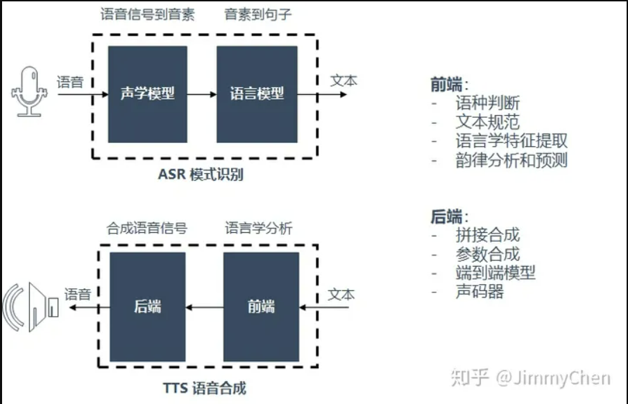

# 01.语音合成入门介绍

语音合成（Text To Speech）技术将输入的文本合成为能够播放的人类语音，处理过程上可以理解成语音识别的反向过程，所以应用的目标上必然是做到能够合成媲美人声的语音。而在老式的科幻片中，机器人都是这样说话的：

>“大 - 家 - 好，我 - 是 - 机 - 器 - 人 ”

**逐字发音，声音粗糙没有韵律，缺乏连贯性。**

当前语音合成技术通常将整个合成系统分成前端和后端两大部分：

1. 语音合成通用技术架构

    1. 语音前端：负责进行语言学分析。主要包括一下功能：
   - 语种判断：首先要判断当前输入的文本是什么语言，中文普通话，英文，粤语还是什么。
   - 文本规范：知道是中文普通话之后，需要转换为规范化的文本，尤其针对各种符号、数字。
       > 1）数字进制：宝马4系列的轿车需要896,500元，"896,500"应展开为"八十九万六千五百；
       > 
       > 2）年代：如中国在4000年前就开始物种驯化，中"4000"应该是进制读法"四千"；秦朝建立与公元前221年，中"211"应该是位制读法"两百二十一年"；马克思生于1818年，中"1818"应该采用顺序读法"一八一八"。
       > 
       > 3）长数字：如"0724-4356333"，"182-3123-3213"，"（+86）182-3123-3213 ，身份证，邮编；
       > 
       > 4）分数小数百分数： 如"1/2""2%""0.9882；
       > 
       > 5）时间：如"2019/9/11","23:11"，"5pm"
       > 
       > 6）电台频率 FM940，FM101.7

   - 语言学特征提取：通常都会基于一个发音词典，得到当前文本的发音标注，作为后端模型的主要输入，描述当前文本的语言学特征音素。中文普通话中影响特征提取的两大音素一个是分词，另一个就是多音字：

   - 韵律分析和预测：为了让合成音贴近真人，我们希望在合成对应的文本时各个词语、各个文字用分别用多长的语气，哪些地方应该连读，哪些地方应该要停顿，语调上是轻读还是重读，怎么体现抑扬顿挫和高低曲折。这部分会涉及大量语言学（甚至自然语言处理）的知识，针对于不同的文本内容进行不同的合成演绎，也是语音合成的难点。

    文本分析可以看文章[语音合成学习（一）综述](https://cloud.tencent.com/developer/article/2104364?areaId=106001)
    

   1. 声学后端：基于语言学特征，合成为音频

   前端是从文本当中获得足够多的特征信息，后端部分则基于这些对应的特征找到匹配的音库，合成语音并生成波形。目前这一部分主要的技术思路有三种：基于拼接、基于参数合成和基于端到端。详细参考：[声学后端](https://zhuanlan.zhihu.com/p/142021307)

2. 场景

一般语音合成使用场景主要有外呼、智能客服、智能语音交互、语音阅读等。简单讲：自动播放文本内容或对话。
可以参考思必驰的DUI开放平台[语音合成/TTS](https://cloud.aispeech.com/openSource/technology/tts)

3. 语音合成的质量

如果评估语音合成的质量呢？主要通过以下方法来评测：

   1. TTS主观评测
   TTS采用的主要评估方式是进行MOS评测，从各个维度打分，最后给出一个平均分。

   2. 客观评测

   除了主观评测之外，TTS也能够针对语言学部分进行客观评测，以中文普通话为例：我们有400多个基本音节，5000多个多音字。可以准备相应的文本语料，覆盖主要的基本音节，覆盖常用的多音字，查看输出的前端结果中拼音标准是否和预期一致。

   3. 合成性能指标
      
   实时率RTF（Real Time Factor）= 合成时间 / 音频长度

   合成的耗时同文本的长度一般正相关，如果TTS是整体合成完成之后再吐出音频文件，通常耗时不固定，不适合做语音交互；另外一种TTS能够基于文本预测进行分词断句，逐步的输出音频流就能够保证最高耗时，这类产品只需要关注首包输出的响应时间，更适合作为语音交互的TTS方案。TTS合成的耗时同ASR一样，采用实时率RTF（Real Time Factor）进行评估，例如：正常人的语速每秒钟4个字左右，10个字对应3秒的语音，如果能够在400ms内完成10个字的合成，开始语音播报基本能满足语音的实时性要求，对应：
   
   > RTF = 合成时间 / 音频长度

   > RTF = 400 / 3000 = 0.13
